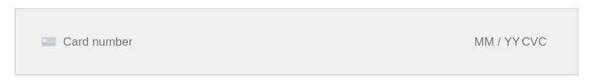

# Payment Methods

The Stripe extension implements the following payment methods:

## Credit / Debit Card

### Card Element

See: [Stripe Card Element](https://stripe.com/docs/payments/payment-methods/overview#cards).

This is enabled by default. No additional configuration is required.

It is supported for all payment types.

#### MOTO (Mail Order Telephone Order) Payments

If you want to take payments in this way you have to:
1. Request that it is enabled on your Stripe account.
2. Enable "MOTO payments" in CiviCRM Stripe settings.
3. Give the "CiviCRM Stripe: Process MOTO transactions" permission to roles which are allowed to process MOTO payments (eg. administrator).

It will only be available on backend forms.

### Payment Request Button (Apple/Google/Microsoft Pay)

See: [Stripe PaymentRequest Button](https://stripe.com/docs/stripe-js/elements/payment-request-button).

#### Configuration

In *Administer->CiviContribute->Stripe Settings* you need to set `Country where your account is registered` to
 the two character country code of your account (eg. "US").

#### Supported configurations

The PaymentRequest element will be displayed automatically instead of the card element if:
1. The client browser has support for the paymentRequest button.
2. The payment is a *one-off*. Recurring payments are not supported and the element will not be displayed in this case.
